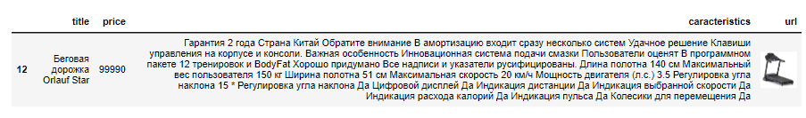

# Построение моделей для сравнения цен на похожие товары.


## Цель проекта.
Основная цель проекта - находить похожие/аналогичные товары для заданной категории в публичном доступе по текстовой информации о них для позиционирования и/или предсказания рекомендуемой цены. 

## Этапы проекта.
Этапы проекта включают:
- **Получение исходных данных для анализа** - будем использовать уже опубликованные данные, поэтому репозиторий сделаю публичным :)
- **Сбор данных конкурентов** - буду собирать информацию в онлайн магазинах по тем же самым категориям, что и в исходных данных.
- **Векторизация собранной информации** - буду использовать модель LaBSE, которую можно найти по [ссылке](https://huggingface.co/sentence-transformers/LaBSE), так как в текстах есть латиница и кириллица
- **Поиск похожих товаров** - воспользуюсь косинусной близостью для определения похожих товаров. Буду пробовать разные текстовые описания и анализировать результат для конкретных артикулов. Посмотрю также на величину индекса похожести для использования в дальнейших шагах.
Далее для анализируемых товаров попробуем построить **интервал с минимальной/максимальной ценой** товаров с заданным уровнем похожести, что поможет определить качество спарсенной выборки и/или уникальности товара, а также место товара среди похожих по его цене.
И последний этап - **определение рекомендуемой цены** и сравнение ее с фактической/планируемой - можно использовать разные модели для регрессии на основе векторов, полученных на предыдущем этапе. Регрессоры будут обучаться на спарсенных данных (либо на всех для категории, либо отобранных по пороговому индексу похожести для категории) в зависимости от кол-ва собранных данных и индекса похожести.

</li>

### Этап 1. Получение исходных данных для анализа.
Для экспериментов и моделирования возьмем данные для 2-х категорий товаров:
<li> беговые дорожки - в категории почти 150 артикулов. Пример полученных данных на рисунке ниже. 
  

  
<li> степперы - категория включает примерно 50 артикулов, данные получены в аналогичном виде.

  
</li>

Данные собраны в [файл](data/competitors_data.csv). 

### Этап 2. Сбор данных конкурентов.
Для сравнения будем собирать данные по этим же 2-м категориям с аналогичной структурой. На 04.09.2023 собраны следующие данные:


В данных есть ряд пропусков, но в целом получилось собрать довольно много информации, так что можно приступать к следующему этапу после небольшой очистки и приведению данных к общему виду.

  

Для сбора данных использовались парсеры как со статических, так и с динамических сайтов. Все парсеры собраны в данной [папке](data_parcers).


### Этап 3.Поиск похожих товаров.
#### Этап 3.1. Поиск похожих товаров для конкретного артикула.

Данные о товаре включают несколько элементов:
1.  **Название** - title, описание товара, указанное продавцом. Чаще всего включает категорию, бренд и модель товара. 
2.  **Категории товара** - я собирала 3 категории, последняя чаще всего подразумевает бренд, первые две - более широкие подгруппы товаров.
3. **Характеристики** - технические характеристика товара, перечень указывается на усмотрение продавца, часто есть похожие элементы.
4.  **Описание** - описание товара в произвольной форме, бывает очень разным в зависимости от продавца, поэтому его не будем использовать.

Итак, для формирования векторов для каждого товара буду использовать следующие комбинации данных о товара и посмотрю, как различаются рекомендации для конкретных артикулов:

1. :pencil: Только названия товаров (title)
2. :pencil: Название + 3 категории
3. :pencil: 3 категории + характеристики
4. :pencil: Название товаров + характеристики
5. :pencil: Только характеристики
6. :pencil: Название + 3 категории + характеристики

Будем использовать функцию, которая принимает такие параметры как артикул, анализируемый датафрейм, датафрейм для сравнения **(более детально - код по ссылке ниже)** и выводит датафрейм с топ-3 максимально похожими рекомендациями для выбранного артикула и их индексом похожести на артикул.

<hr>
<details>
  <summary>Code details - click to open</summary>

 ```python 
 def search_similar(article, data, competitors,data_vect, competitors_vect, sim_threshhold):
    """article - item to review from own dat
       data - dataframe with own products
       competitors - dataframe with competitors' products
       data_vect - data in vectorized form
       competitors_vect - competitors data in vectorized form
       sim_threshhold - min similarity score to be inlcuded in recommendation"""
    
    query = data[data['article'] == article]
    
    data_emb = sparse.csr_matrix(data_vect)
    competitors_emb = sparse.csr_matrix(competitors_vect)
    index = query.index[0]
    
    similarity = cosine_similarity(data_emb[index], competitors_emb).flatten()
    ind = np.argwhere(similarity > sim_threshhold)

    if ind.shape[0] == 0:
        print('No items to compare in the sampling!')

    else:
        scores = similarity[similarity > sim_threshhold]
        match = sorted(zip(scores, ind.tolist()), reverse=True)
        temp = pd.DataFrame()
        temp_lst = []
        temp = temp.append(competitors.iloc[match[0][1]][['title', 'price','caracteristics', 'url']])
        temp_lst.append(round(match[0][0], 2))
       
        try:
            temp = temp.append(competitors.iloc[match[1][1]][['title', 'price','caracteristics', 'url']])
            temp_lst.append(round(match[1][0], 2))           
        except:
            print('No top 2 identified!')
            
        try:
            temp = temp.append(competitors.iloc[match[2][1]][['title', 'price','caracteristics', 'url']])
            temp_lst.append(round(match[2][0], 2))           
        except:
            print('No top 3 identified!')
    temp['sim_score'] = temp_lst
    display(temp.style.format({'url': show_image, **{'width': '200px'}})
```
</details>
<hr>


> [!IMPORTANT]
> **Протестируем все варианты векторов для артикулов 400081342 (степпер), 400123365 (беговая дорожка) и на выбор рандомного алгоритма.**

> **Результат:**
> Для степпера справились все варианты, кроме 5 (только характеристики) - в качестве топ-3 была выбрана беговая дорожка вместо степпера. Лучший вариант у комбинации название + характеристики, нашлись все 3 варианта одного и того же тренажера у разных поставщиков, при всех остальных комбинациях  - только 2. Пример лучшего поиска похожих для для артикула 400081342 (степпер):


По второму артикулу - беговой дорожке - отлично справился только поиск только по названию и нашел все 3 аналога. В вариантах, где не использовался title как часть векторов, находился только один аналог.


В качестве рандомного кейса попался интересный уникальный продукт - детская беговая дорожка, который мало представлен у конкурентов. Понятно, что все варианты не нашли точного аналога. :thinking: Интересно, что очень похожую детскую дорожку нашел только вариант, где вектора были сформированы только по характеристикам товара.



Это не совсем то, для детей не подойдет.


Вот это уже получше, хотя бы есть из похожей ценовой категории. Наверное, в такой ситуации, лучше бы вообще ничего не находить, а сообщать, что продукт не представлен в выборке!


> **Общий вывод:**
Вариант текстовой информации для формирования векторов нужно выбирать в зависимости от целей исследования и уникальности товара. Если нужно найти те же самые модели, то лучше использовать в векторах название товара (продавцы стараются указать в нем максимально важную информацию для быстрой идентификации и в короткой форме). Если товар уникальный, то можно смотреть только на характеристики.
Для всех вариантов можно сказать, что если индекс похожести больше 0.79, то это та же или очень похожая модель товара.

:raised_eyebrow: Очень удобно уметь находить похожие товары для конкретного артикула, может пригодиться в рекомендательных системах или точечного анализа артикула, но хотелось бы уметь анализировать всю категорию сразу и понимать, цены на какие артикулы выходят за пределы рынка. Поэтому переходим к следующему этапу.

#### Этап 3.2. Анализ цен на похожие товары для всей категории.
 
Подготовим функцию, которая будем принимать датафреймы с исходными данными, данные конкурентов, их векторные формы и выбранный индекс похожести и выводить на основе полученных данных график, где будет показана текущая цена в сравнении с минимальной и максимальной ценой по похожим товарам **(более детально - код по ссылке ниже)**.

 Дополнительно посмотрим, какой процент артикулов во всей категории оказался без аналогов (т.е. индекс похожести ниже выбранного уровня).

 > [!IMPORTANT]
> **Индекс похожести будем брать от 0.79 и выше, как выяснили на предыдущем этапе.**

<hr>
<details>
  <summary>Code details - click to open</summary>

 ```python 
 def market_review(data, competitors, data_vect, competitors_vect, sim_threshhold):
        """data - dataframe with own products
       competitors - dataframe with competitors' products
       data_vect - data in vectorized form
       competitors_vect - competitors data in vectorized form
       sim_threshhold - min similarity score to be inlcuded in recommendation"""

    avg_score_lst = []
    price_max_lst = []
    price_min_lst = []
    rec = data.copy()
    data_emb = sparse.csr_matrix(data_vect)
    competitors_emb = sparse.csr_matrix(competitors_vect)
    
    for item in range(len(data)):
        similarity = cosine_similarity(data_emb[item], competitors_emb).flatten()
        ind = np.argwhere(similarity > sim_threshhold)
        if ind.shape[0] == 0:
            avg_score_lst.append(0)
            price_max_lst.append(0)
            price_min_lst.append(0)
        else:
            scores = similarity[similarity > sim_threshhold]
            match = sorted(zip(scores, ind.tolist()), reverse=True)
            avg_score = round(sum(i for i,j in match)/len(match), 2)
            avg_score_lst.append(avg_score)
            price_max = competitors.iloc[[j[0] for i, j in match]]['price'].max()
            price_max_lst.append(price_max)
            price_min = competitors.iloc[[j[0] for i, j in match]]['price'].min()
            price_min_lst.append(price_min)
    
    zeros =  avg_score_lst.count(0)      
    rec['avg_sim_score'] = avg_score_lst
    rec['price_max'] = price_max_lst
    rec['price_min'] = price_min_lst
    rec = rec.sort_values(by = 'price_max')
    
    plt.figure(figsize = [10,4])
    plt.fill_between(y1 = rec['price_max'],
                     y2 = rec['price_min'],
                    x = np.linspace(0,len(rec), num = len(rec)).astype(int),
                    alpha = 0.4,
                    label = 'Max/min intervals')
    sns.scatterplot(x = np.linspace(0,len(rec), num = len(rec)).astype(int),
                  y = rec['price'], label = 'Current Price')

    plt.legend(loc = 'best')
    plt.ylim(0,200000)
    plt.title(f"Sampling review with avg_sim_score = {round(rec['avg_sim_score'].mean(), 2)}, n_items with 0 score = {round(zeros/len(rec)*100)}%")
    plt.show()
```
</details>
<hr>

Итак, похожие товары отобраны для каждого артикула в категории, для них определены максимальные и минимальные цены. Все данные на графиках отсортированы по возрастанию максимальной цены похожих товаров.
Для индекса 0.79 интереснее всего получились результаты для векторов только с названием и со всеми данными. Мы можем наблюдать, что растет и фактическая цена вмести с максимальной по рынку. 


Здесь ситуация хуже и очень много артикулов остались без аналогов.


А вот последний вариант выглядит даже очень прилично. При этом разница между максимальной и минимальной ценой на похожие здесь меньше всего.


При этом, если уменьшать пороговое значение индекса похожести, то аналоги находятся практически для всех артикулов, но увеличивается разница между минимальным и максимальным значениями, что заставляет сомневаться в корректности подобранных похожих товаров. Мое ожидание  - цены на похожие товары не должны сильно различаться :money_mouth_face:

Пример для векторов с максимальной информацией и индексом похожести 0.75.


> **Общий вывод:**
При анализе всей категории нужно использовать довольно высокие значения уровня похожести, чтобы получить приемлемые результаты. Такой анализ также позволяет выявить уникальные товары и оценить качество исходной выборки.

#### Этап 3.3. Прогнозирование цены на основании описания и поиска похожих.

Итак, поиск похожих на основе векторного представления товаров позволяет искать рекомендации для конкретного артикула и сравнивать всю категорию с выборкой товаров конкурентов, но хотелось бы научиться получать рекомендуемую цену для артикула на основе анализа похожих товаров.

Для этого обучим модель на основе данных конкурентов предсказывать цену по текстовому описанию. Будем экспериментировать также на разных векторных представлениях товаров и попробуем разные методы бустинга. Для этого воспользуемся функцией, которая будет принимать в качестве параметров модель, данные для анализа и их векторные представления, данные конкурентов и их векторные представления, а также пороговое значение индекса похожести **(более детально - код по ссылке ниже)**.

**Пороговое значение** индекса похожести будет использоваться для формирования обучающей выборке для модели.


<hr>
<details>
  <summary>Code details - click to open</summary>

 ```python 
 def group_price_pred(model, data, competitors, data_vect, competitors_vect, sim_threshhold):
            """data - dataframe with own products
       competitors - dataframe with competitors' products
       data_vect - data in vectorized form
       competitors_vect - competitors data in vectorized form
       sim_threshhold - min similarity score to be inlcuded in recommendation"""

    similar_items = []
    scores_total = []
    gr = data.copy()
    data_emb = sparse.csr_matrix(data_vect)
    competitors_emb = sparse.csr_matrix(competitors_vect)
    
    for item in range(len(data)):
        similarity = cosine_similarity(data_emb[item], competitors_emb).flatten()
        ind = np.argwhere(similarity > sim_threshhold)
        if ind.shape[0] == 0:
            pass
        else:
            scores = similarity[similarity > sim_threshhold]
            scores_total.extend(scores)
            flat_list = [item for sublist in ind.tolist() for item in sublist]
            similar_items.extend(flat_list)
    group_ind = set(similar_items)
    
    group_avg_score = round(sum(scores_total)/len(scores_total),2)
    
    print(f'Total similar items for the group = {len(group_ind)}')
    
    if len(group_ind) <= len(data):
        print('Similar group is too small, prediction not possible!')
    else:
        X = competitors_emb[list(group_ind)]
        y = competitors['price'][list(group_ind)]
        X_train, X_test, y_train, y_test = train_test_split(X,y, test_size = 0.2, random_state = 42)
        model.fit(X_train, y_train)
        y_pred = model.predict(X_test)
        RMSE = round(np.sqrt(mean_squared_error(y_test, y_pred)),2)
        new_row = {'RMSE':round(np.sqrt(mean_squared_error(y_test, y_pred)),2),
                   'R2_score': round(r2_score(y_test, y_pred),4)}
        
        print(f'Log: training done, results: {new_row}')
        
        X_val = data_emb
        y_val = model.predict(X_val)
        gr['pred_price'] = y_val
        
        gr = gr.sort_values(by = 'price')
        
        plt.figure(figsize = [10,4])
        plt.fill_between(y1 = gr['pred_price'] - RMSE,
                             y2 = gr['pred_price'] + RMSE,
                            x = np.linspace(0,len(gr), num = len(gr)).astype(int),
                            alpha = 0.2,
                            label = 'Conf intervals')
        sns.scatterplot(x = np.linspace(0,len(gr), num = len(gr)).astype(int),
                      y = gr['pred_price'], label = 'Prediction')
        sns.scatterplot(x = np.linspace(0,len(gr), num = len(gr)).astype(int),
                      y = gr['price'], label = 'Current Price')
        plt.legend(loc = 'best')
        plt.ylim(0,200000)
        plt.title(f'Price prediction based on similarity score, group_avg = {group_avg_score}, RMSE = {RMSE}')
        plt.show()
```
</details>
<hr>

Сперва поставим уровень похожести от 0 и выше, т.е. обучим CatBoostRegressor на всей выборке конкурентов.
Результаты расстраивают, причем для всех вариантов векторов - очень большая RMSE и предсказанные цены далеки от реальных.


 > [!IMPORTANT]
> **Попробуем отфильтровать обучающую выборку, выбрав пороговое значение 0.79 для критерия отбора. Воспользуемся несколькими моделями CatBoostRegressor, XGBRFRegressor и LGBMRegressor**

Получилось намного лучше - RMSE ниже и предсказанные цены намного ближе к реальным ценам, используемым в интернет-магазине. Лучше всего получилось у CatBoostRegressor для векторов, построенных только на названии и с полным набором информации. Для ряда комбинаций вообще не получилось сделать предсказание цены, так как обучающая выборка после фильтрации оказалась меньше исходного массива данных.

**Предсказание цены для модели CatBoostRegressor для индекса похожести 0,79 и выше**


> **Общий вывод:**
В целом по векторному представлению слов возможно предсказывать рекомендуемую цену товара, но при этом необходимо обеспечить достаточное представление товара в выборках конкурентов. 

На этом пока все :stuck_out_tongue_winking_eye:


