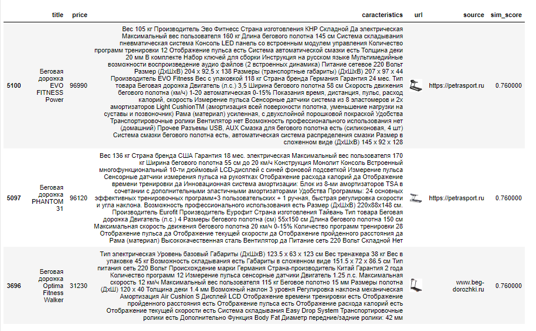
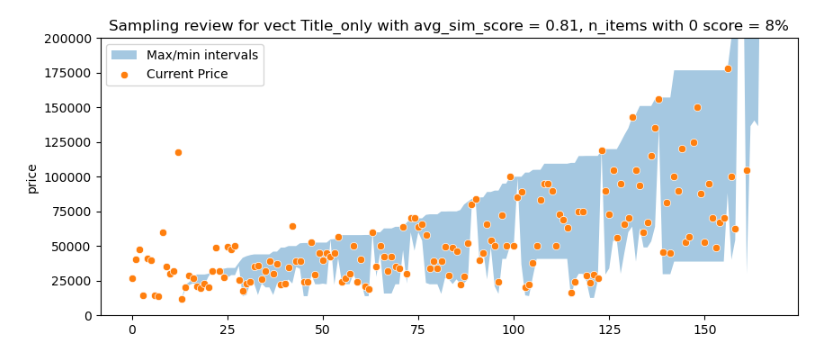
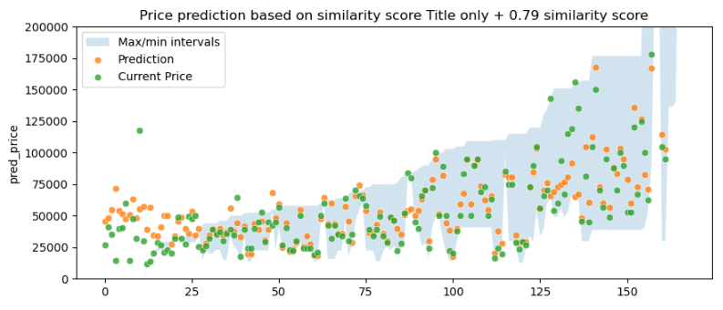

# Построение моделей для сравнения цен на похожие товары.


## Цель проекта.
Основная цель проекта - находить похожие/аналогичные товары для заданной категории в публичном доступе по текстовой информации о них для позиционирования и/или предсказания рекомендуемой цены. 

## Этапы проекта.
Этапы проекта включают:
- **Получение исходных данных для анализа** 
- **Сбор данных конкурентов** 
- **Векторизация собранной информации** - на основе модели LaBSE, которую можно найти по [ссылке](https://huggingface.co/sentence-transformers/LaBSE), так как в текстах есть латиница и кириллица
- **Поиск похожих товаров** - воспользуюсь косинусной близостью для определения похожих товаров. Оценивать похожесть буду в несколько этапов:
           - Оценка зрительских симпатий - буду смотреть как подобрались похожие товары для 3-х рандомных артикулов с точки зрения пользователя. Заодно посмотрю также на величину индекса похожести для использования в дальнейших шагах.
          - Оценка корректности **интервала максм/мин цен** для каждого артикула группы - буду смотреть на % с нулевым индексом похожести, средний размах интервала, средний скор похожести и % артикулов в рамках найденного интервала.
           - RMSE + R2 при обучении **регрессора** на рыночных данных, отобранных по пороговому индексу похожести. В качестве валидациооной выборки буду использовать часть рыночных данных конкурентов, в качестве тестовой - данные магазина.

### Этап 1. Получение исходных данных для анализа.
Исходные данные - беговые дорожки - в категории почти 160 артикулов. Пример полученных данных на рисунке ниже. 
  

  
Данные собраны в [файл](data/competitors_data.csv). 

### Этап 2. Сбор данных конкурентов.
Для сравнения будем собирать данные с аналогичной структурой. Собрано около 6 700 артикулов со следующих сайтов.


При этом следует обратить внимание на разницу в длине текстов характеристик артикулов в исходных данных (в среднем 400-500 слов) и данных конкурентов (в среднем 1000-2000 слов).

Для сбора данных использовались парсеры как со статических, так и с динамических сайтов. Все парсеры собраны в данной [папке](data_parcers).
Данные собраны в [файл](data/competitors_data.csv). 

### Этап 3.Поиск похожих товаров.
#### Этап 3.1. Поиск похожих товаров для конкретного артикула.

Ноутбук с кодом, описанном ниже по ссылке [здесь](https://github.com/shakhovak/Price_comparison_models/blob/master/Simialarity_search.ipynb).

Данные о товаре включают несколько элементов:
1.  **Название** - title, описание товара, указанное продавцом. Чаще всего включает категорию, бренд и модель товара. 
2.  **Категории товара** - я собирала 3 категории, последняя чаще всего подразумевает бренд, первые две - более широкие подгруппы товаров.
3. **Характеристики** - технические характеристика товара, перечень указывается на усмотрение продавца, часто есть похожие элементы.
4.  **Описание** - описание товара в произвольной форме, бывает очень разным в зависимости от продавца, поэтому его не будем использовать.

Итак, для формирования векторов для каждого товара буду использовать следующие комбинации данных о товара и посмотрю, как различаются рекомендации для конкретных артикулов:

1. :pencil: Только названия товаров (title)
2. :pencil: Название + 3 категории
3. :pencil: Название товаров + характеристики (полные)
4. :pencil: Название + характеристики (частичные)[^1]


[^1] выделю из всего текста только определенные характеристики (вес пользователя, скорость, мощность и т.д.) с помощью окна на 3-7 слов и расстояния [Левенштейна](https://pypi.org/project/thefuzz/).

<hr>
<details>
  <summary>Code details - click to open</summary>

 ```python 
        from thefuzz import fuzz
        from nltk import ngrams

        def find_text(target, text, threshhold):
            combo = []
            for n in range(3,8): 
                n_grams = ngrams(text.split(), n)
                for grams in n_grams:
                    temp = ' '.join(grams)
                    combo.append(temp)
            score_lst = []
            for item in combo:
                score = fuzz.ratio(target, item)
                score_lst.append(score)

            ind = np.argwhere(score_lst)
            match = sorted(zip(score_lst, ind.tolist()), reverse=True)
            if (len(match) == 0) or (match[0][0]<threshhold):
                return None
            else:
                return combo[match[0][1][0]]
```
</details>
<hr>

Для подбора похожих будем использовать функцию, которая принимает такие параметры как артикул, анализируемый датафрейм, датафрейм для сравнения **(более детально - код по ссылке ниже)** и выводит датафрейм с топ-3 максимально похожими рекомендациями для выбранного артикула и их индексом похожести на артикул.

<hr>
<details>
  <summary>Code details - click to open</summary>

 ```python 
 def search_similar(article, data, competitors,data_vect, competitors_vect, sim_threshhold):
    """article - item to review from own dat
       data - dataframe with own products
       competitors - dataframe with competitors' products
       data_vect - data in vectorized form
       competitors_vect - competitors data in vectorized form
       sim_threshhold - min similarity score to be inlcuded in recommendation"""
    
    query = data[data['article'] == article]
    
    data_emb = sparse.csr_matrix(data_vect)
    competitors_emb = sparse.csr_matrix(competitors_vect)
    index = query.index[0]
    
    similarity = cosine_similarity(data_emb[index], competitors_emb).flatten()
    ind = np.argwhere(similarity > sim_threshhold)

    if ind.shape[0] == 0:
        print('No items to compare in the sampling!')

    else:
        scores = similarity[similarity > sim_threshhold]
        match = sorted(zip(scores, ind.tolist()), reverse=True)
        temp = pd.DataFrame()
        temp_lst = []
        temp = temp.append(competitors.iloc[match[0][1]][['title', 'price','caracteristics', 'url']])
        temp_lst.append(round(match[0][0], 2))
       
        try:
            temp = temp.append(competitors.iloc[match[1][1]][['title', 'price','caracteristics', 'url']])
            temp_lst.append(round(match[1][0], 2))           
        except:
            print('No top 2 identified!')
            
        try:
            temp = temp.append(competitors.iloc[match[2][1]][['title', 'price','caracteristics', 'url']])
            temp_lst.append(round(match[2][0], 2))           
        except:
            print('No top 3 identified!')
    temp['sim_score'] = temp_lst
    display(temp.style.format({'url': show_image, **{'width': '200px'}})
```
</details>
<hr>


> [!IMPORTANT]
> **Протестируем все варианты векторов для 3-х рандомных артикулов.**

> **Результат:**
> В результате спарвились все варианты, только при векторизации полного описания в 2-х случаях бли подобраны очень разнообразные артикулы, в одном - совсем не похожий.

Оригинальный товар:


Топ-3 рекомендации алгоритма на векторах из названия и полных характеристик.



#### Этап 3.2. Анализ цен на похожие товары для всей категории.
 
Подготовим функцию, которая будем принимать датафреймы с исходными данными, данные конкурентов, их векторные формы и выбранный индекс похожести и выводить на основе полученных данных график, где будет показана текущая цена в сравнении с минимальной и максимальной ценой по похожим товарам **(более детально - код по ссылке ниже)**.

 Дополнительно посмотрим, какой процент артикулов во всей категории оказался без аналогов (т.е. индекс похожести ниже выбранного уровня).

 > [!IMPORTANT]
> **В качестве пороговых значений индекс похожести будем брать от 0.75, 0.79 и 0.8**

<hr>
<details>
  <summary>Code details - click to open</summary>

 ```python 
 def market_review(data, competitors, data_vect, competitors_vect, sim_threshhold):
        """data - dataframe with own products
       competitors - dataframe with competitors' products
       data_vect - data in vectorized form
       competitors_vect - competitors data in vectorized form
       sim_threshhold - min similarity score to be inlcuded in recommendation"""

    avg_score_lst = []
    price_max_lst = []
    price_min_lst = []
    rec = data.copy()
    data_emb = sparse.csr_matrix(data_vect)
    competitors_emb = sparse.csr_matrix(competitors_vect)
    
    for item in range(len(data)):
        similarity = cosine_similarity(data_emb[item], competitors_emb).flatten()
        ind = np.argwhere(similarity > sim_threshhold)
        if ind.shape[0] == 0:
            avg_score_lst.append(0)
            price_max_lst.append(0)
            price_min_lst.append(0)
        else:
            scores = similarity[similarity > sim_threshhold]
            match = sorted(zip(scores, ind.tolist()), reverse=True)
            avg_score = round(sum(i for i,j in match)/len(match), 2)
            avg_score_lst.append(avg_score)
            price_max = competitors.iloc[[j[0] for i, j in match]]['price'].max()
            price_max_lst.append(price_max)
            price_min = competitors.iloc[[j[0] for i, j in match]]['price'].min()
            price_min_lst.append(price_min)
    
    zeros =  avg_score_lst.count(0)      
    rec['avg_sim_score'] = avg_score_lst
    rec['price_max'] = price_max_lst
    rec['price_min'] = price_min_lst
    rec = rec.sort_values(by = 'price_max')
    
    plt.figure(figsize = [10,4])
    plt.fill_between(y1 = rec['price_max'],
                     y2 = rec['price_min'],
                    x = np.linspace(0,len(rec), num = len(rec)).astype(int),
                    alpha = 0.4,
                    label = 'Max/min intervals')
    sns.scatterplot(x = np.linspace(0,len(rec), num = len(rec)).astype(int),
                  y = rec['price'], label = 'Current Price')

    plt.legend(loc = 'best')
    plt.ylim(0,200000)
    plt.title(f"Sampling review with avg_sim_score = {round(rec['avg_sim_score'].mean(), 2)}, n_items with 0 score = {round(zeros/len(rec)*100)}%")
    plt.show()
```
</details>
<hr>

> **Общий вывод:**
Более низкий индекс похожести дает больший размах мин/макс интервала и большое кол-во исходных артикулов в рамках данного интервала. Наиболее оптимальные варианты - title Или title + short charact.


Визуализация результатов подбора интервалов для лучшего алгоритма Title + 0.8 индекс похожести.


#### Этап 3.3. Прогнозирование цены на основании описания и поиска похожих.


Для этого обучим модель на основе данных конкурентов предсказывать цену по текстовому описанию. Для этого воспользуемся функцией, которая будет принимать в качестве параметров модель, данные для анализа и их векторные представления, данные конкурентов и их векторные представления, а также пороговое значение индекса похожести **(более детально - код по ссылке ниже)**.

<hr>
<details>
  <summary>Code details - click to open</summary>

 ```python 
 def group_price_pred(model, data, competitors, data_vect, competitors_vect, sim_threshhold):
            """data - dataframe with own products
       competitors - dataframe with competitors' products
       data_vect - data in vectorized form
       competitors_vect - competitors data in vectorized form
       sim_threshhold - min similarity score to be inlcuded in recommendation"""

    similar_items = []
    scores_total = []
    gr = data.copy()
    data_emb = sparse.csr_matrix(data_vect)
    competitors_emb = sparse.csr_matrix(competitors_vect)
    
    for item in range(len(data)):
        similarity = cosine_similarity(data_emb[item], competitors_emb).flatten()
        ind = np.argwhere(similarity > sim_threshhold)
        if ind.shape[0] == 0:
            pass
        else:
            scores = similarity[similarity > sim_threshhold]
            scores_total.extend(scores)
            flat_list = [item for sublist in ind.tolist() for item in sublist]
            similar_items.extend(flat_list)
    group_ind = set(similar_items)
    
    group_avg_score = round(sum(scores_total)/len(scores_total),2)
    
    print(f'Total similar items for the group = {len(group_ind)}')
    
    if len(group_ind) <= len(data):
        print('Similar group is too small, prediction not possible!')
    else:
        X = competitors_emb[list(group_ind)]
        y = competitors['price'][list(group_ind)]
        X_train, X_test, y_train, y_test = train_test_split(X,y, test_size = 0.2, random_state = 42)
        model.fit(X_train, y_train)
        y_pred = model.predict(X_test)
        RMSE = round(np.sqrt(mean_squared_error(y_test, y_pred)),2)
        new_row = {'RMSE':round(np.sqrt(mean_squared_error(y_test, y_pred)),2),
                   'R2_score': round(r2_score(y_test, y_pred),4)}
        
        print(f'Log: training done, results: {new_row}')
        
        X_val = data_emb
        y_val = model.predict(X_val)
        gr['pred_price'] = y_val
        
        gr = gr.sort_values(by = 'price')
        
        plt.figure(figsize = [10,4])
        plt.fill_between(y1 = gr['pred_price'] - RMSE,
                             y2 = gr['pred_price'] + RMSE,
                            x = np.linspace(0,len(gr), num = len(gr)).astype(int),
                            alpha = 0.2,
                            label = 'Conf intervals')
        sns.scatterplot(x = np.linspace(0,len(gr), num = len(gr)).astype(int),
                      y = gr['pred_price'], label = 'Prediction')
        sns.scatterplot(x = np.linspace(0,len(gr), num = len(gr)).astype(int),
                      y = gr['price'], label = 'Current Price')
        plt.legend(loc = 'best')
        plt.ylim(0,200000)
        plt.title(f'Price prediction based on similarity score, group_avg = {group_avg_score}, RMSE = {RMSE}')
        plt.show()
```
</details>
<hr>

Визуализация результатов лучшего алгоритма title only + 0.75 пороговое значение индекса похожести:


> **Сводный вывод:**
 


Визуализация сводных данных для лучшего алгоритма:


На этом пока все :stuck_out_tongue_winking_eye:

