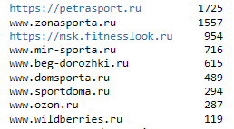
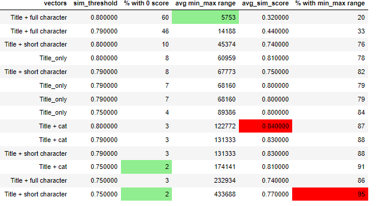

# Построение моделей для сравнения цен на похожие товары.


## Цель проекта.
Основная цель проекта - находить похожие/аналогичные товары для заданной категории в публичном доступе по текстовой информации о них для позиционирования и/или предсказания рекомендуемой цены. 

## Этапы проекта.
Этапы проекта включают:
<li> Получение исходных данных для анализа - будем использовать уже опубликованные данные, поэтому репозиторий сделаю публичным :)
<li> Сбор данных конкурентов - буду собирать информацию в онлайн магазинах по тем же самым категориям, что и в исходных данных.
<li> Векторизация собранной информации - буду использовать модель LaBSE, которую можно найти по ссылке (https://huggingface.co/sentence-transformers/LaBSE), так как в текстах есть латиница и кириллица
<li> Поиск похожих товаров - воспользуюсь косинусной близостью для определения похожих товаров. Буду пробовать разные текстовые описания и анализировать результат для конкретных артикулов. Посмотрю также на величину индекса похожести для использования в дальнейших шагах.
Далее для анализируемых товаров попробуем построить интервал с минимальной/максимальной ценой товаров с заданным уровнем похожести, что поможет определить качество спарсенной выборки и/или уникальности товара, а также место товара среди похожих по его цене.
И последний этап - определение рекомендуемой цены и сравнение ее с фактической/планируемой - можно использовать разные модели для регрессии на основе векторов, полученных на предыдущем этапе. Регрессоры будут обучаться на спарсенных данных (либо на всех для категории, либо отобранных по пороговому индексу похожести для категории) в зависимости от кол-ва собранных данных и индекса похожести.

</li>

### Этап 1. Получение исходных данных для анализа.
Для экспериментов и моделирования возьмем данные для 2-х категорий товаров:
<li> беговые дорожки - в категории почти 150 артикулов. Пример полученных данных на рисунке ниже. 
  

  
<li> степперы - категория включает примерно 50 артикулов, данные получены в аналогином виде

  
</li>

Данные собраны в [файл](data/competitors_data.csv). 

### Этап 2.Сбор данных конкурентов.
Для сравнения будем собирать данные по этим же 2-м категориям с аналогичной структурой. На 04.09.2023 собраны следующие данные:



В данных есть ряд пропусков, но в целом получилось собрать довольно много информации, так что можно приступать к следующему этапу после небольшой очитске и приведению данных к обещму виду.

  

Для сбора данных использовались парсеры как со статических, так и с динамических сайтов. Все прасеры собраны в данной [папке](data_parcers).


### Этап 3.Поиск похожих товаров.
#### Этап 3.1. Поиск похожих товаров для конкретного артикула.

Данные о товаре включают несколько элементов:
1. Название - title, описание товара, указнное продавцом. Чаще всего включает категрию, бренд и модель товара. 
2. Категории товара - я собирала 3 категории, последняя чаще всего подразумевает бренд, первые две - более широкие подгруппы товаров.
3. Характеристики - технические характеристика товара, перечень указывается на усмотрение продавца, часто есть похожие элементы.
4. Описание - описание товара в произвольной форме, бывает очень разным в зависимости от продаваца, поэтому его не будем использовать.

Итак, для формирования векторов для каждого товара буду использовать следующие комбинации данных о товара и посмотрю, как раздичаются рекомендации для конкретных артикулов:

1. Только названия товаров (title)
2. Название + 3 категории
3. 3 категории + характеристики
4. Название товаров + характеристики
5. Только характеристики
6. Название + 3 категории + характеристики

Будем использовать следующую функцию, которая принимает параметры ниже и выводит датафрейм с топ-3 рекомендациями и их индексом похожести на анализируемы артикул.

<hr>
<details>
  <summary>Code details - click to open</summary>

 ```python 
 def search_similar(article, data, competitors,data_vect, competitors_vect, sim_threshhold):
    """article - item to review from own dat
       data - dataframe with own products
       competitors - dataframe with competitors' products
       data_vect - data in vectorized form
       competitors_vect - competitors data in vectorized form
       sim_threshhold - min similarity score to be inlcuded in recommendation"""
    
    query = data[data['article'] == article]
    
    data_emb = sparse.csr_matrix(data_vect)
    competitors_emb = sparse.csr_matrix(competitors_vect)
    index = query.index[0]
    
    similarity = cosine_similarity(data_emb[index], competitors_emb).flatten()
    ind = np.argwhere(similarity > sim_threshhold)

    if ind.shape[0] == 0:
        print('No items to compare in the sampling!')

    else:
        scores = similarity[similarity > sim_threshhold]
        match = sorted(zip(scores, ind.tolist()), reverse=True)
        temp = pd.DataFrame()
        temp_lst = []
        temp = temp.append(competitors.iloc[match[0][1]][['title', 'price','caracteristics', 'url']])
        temp_lst.append(round(match[0][0], 2))
       
        try:
            temp = temp.append(competitors.iloc[match[1][1]][['title', 'price','caracteristics', 'url']])
            temp_lst.append(round(match[1][0], 2))           
        except:
            print('No top 2 identified!')
            
        try:
            temp = temp.append(competitors.iloc[match[2][1]][['title', 'price','caracteristics', 'url']])
            temp_lst.append(round(match[2][0], 2))           
        except:
            print('No top 3 identified!')
    temp['sim_score'] = temp_lst
    display(temp.style.format({'url': show_image, **{'width': '200px'}})
```
</details>
<hr>


> [!IMPORTANT]
> Протестируем все варианты векторов для артикулов 400081342 (степпер), 400123365 (беговая дорожка) и случайный артикул.

Для степпера справились все варианты, кроме 5 (только характеристики) - 3 предложил беговую дорожку вместо степпера :(
Лучший вариант у комбинации название + характеристики, нашлись все варианты одного и того же тренажера у разных поставщиков, все остальные только 2.


По второму артикулу - беговой дорожке отлично справился поиск только по названию и нашел все аналоги. В вариантах где не использовался title, находился только один аналог.


В качестве рандомного кейса попался уникальный продукт, которого нет у конкурентов. 


Это не совсем то, даже другая категория.


Вот это уже получше, хотя бы похожая ценовая категория.


В целом, все варианты находят аналоги и присваивают им индекс похожести больше 0,79. Если ниже - это уже другая модель и просто похожая.
Очевидно, что нужно обязательно использовать название (title) при формировании векторов.

Это хорошо уметь находить похожие товары для конкретного артикула, но хотелось бы 